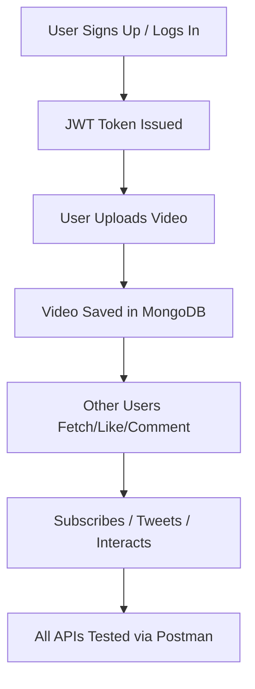

# 🎥 StreamAPI

A powerful and scalable **RESTful backend service** for a video streaming platform. Designed with clean architecture and built using the **MERN stack**, this project covers authentication, video management, comments, subscriptions, and more — ready for production and API testing with Postman.

---

## 🚀 Features

- 🔐 **Authentication** – Secure user login/signup with hashed passwords and JWT tokens
- 📹 **Video Management** – Upload, fetch, update, and delete videos
- 👍 **Likes/Dislikes** – Engage with videos
- 📥 **Subscriptions** – Subscribe or unsubscribe from creators
- 💬 **Comments** – Add and fetch comments on videos
- 🐦 **Tweets** – Micro-post system for updates
- 📦 **Postman Collection** – Easily test all APIs with a pre-configured collection

---

## 🛠️ Tech Stack

- **Backend:** Node.js, Express.js  
- **Database:** MongoDB Atlas  
- **Authentication:** JWT, Bcrypt  
- **Testing:** Postman  
- **Storage:**Cloudinary

---

## 🧩 Project Structure

```
StreamAPI/
├── controllers/         # Route logic
├── models/              # MongoDB schemas
├── routes/              # API endpoints
├── middleware/          # Auth & error handling
├── utils/               # Helper utilities
├── postman/             # Postman collection
├── .env.example         # Example environment variables
└── index.js             # Server entry point
```

## 📁 Project Architecture

- `Express Routes` → Handle video-related requests
- `MongoDB Atlas` → Stores video metadata (title, URL, timestamps)
- `Cloudinary` → Stores actual video files

---

## ⚙️ Setup Instructions

1. **Clone the Repository**
   ```bash
   git clone https://github.com/ShrutiPatel263/StreamAPI.git
   cd StreamAPI
   ```

2. **Install Dependencies**
   ```bash
   npm install
   ```

3. **Configure Environment Variables**
   - Rename `.env.example` to `.env`
   - Add your MongoDB URI, JWT secret, and other values

4. **Run the Development Server**
   ```bash
   npm start
   ```

5. **Import Postman Collection**
   - Go to Postman
   - Click **Import → Files**
   - Select `StreamAPI.postman_collection.json` from `postman/` folder

---

## 🔄 Project Workflow

> Here’s how the application flows behind the scenes:



> ✅ All actions are protected by middleware, logged, and handled securely.

---

## 🧪 API Endpoints Summary

| Method | Route                   | Purpose                    |
|--------|-------------------------|----------------------------|
| POST   | `/api/auth/signup`      | Create user account        |
| POST   | `/api/auth/login`       | Login and get token        |
| POST   | `/api/videos/`          | Upload a video             |
| GET    | `/api/videos/`          | Fetch all videos           |
| POST   | `/api/comments/`        | Add comment to video       |
| GET    | `/api/comments/:id`     | Get comments for a video   |
| POST   | `/api/tweets/`          | Create a tweet             |
| GET    | `/api/users/:id`        | Fetch user details         |

✔️ Explore the full API using the provided Postman collection.

---

## 👩‍💻 About Me

Hi! I’m **Shruti Patel** —  
A passionate **backend developer** and **MERN stack** expert. Currently diving deep into **Machine Learning** and **AI** as a data science student.  
I enjoy building clean, scalable APIs and learning cutting-edge technologies.

🔗 [GitHub](https://github.com/ShrutiPatel263)


